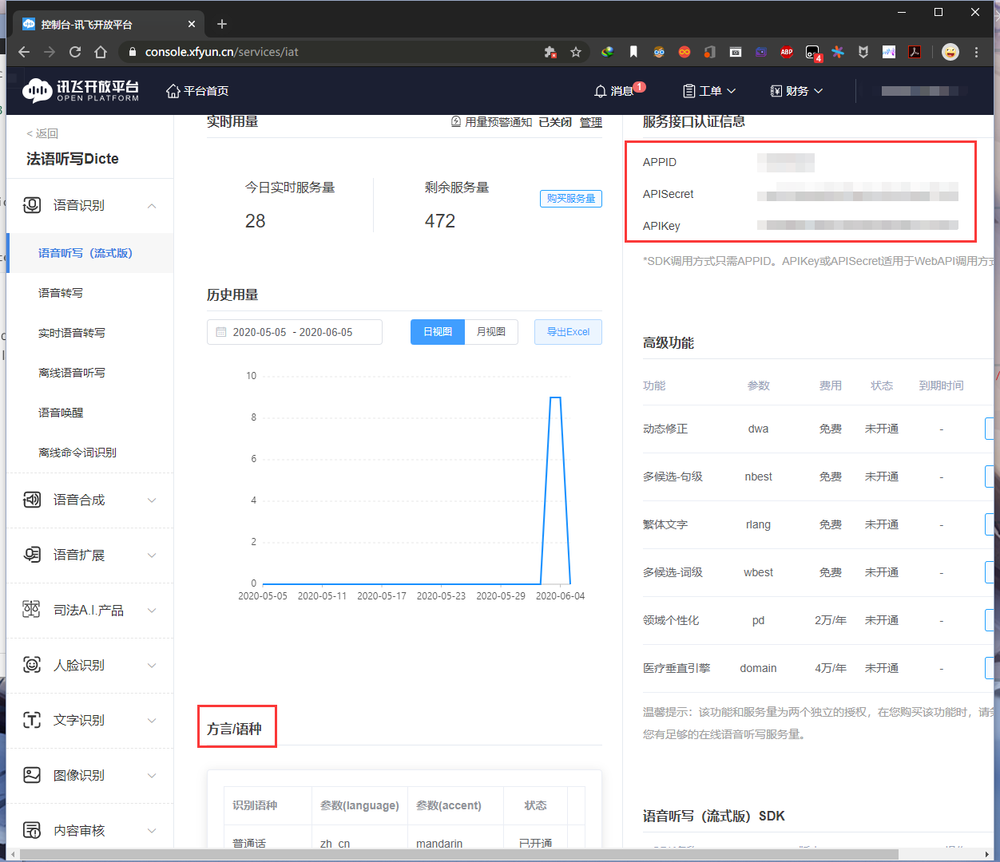
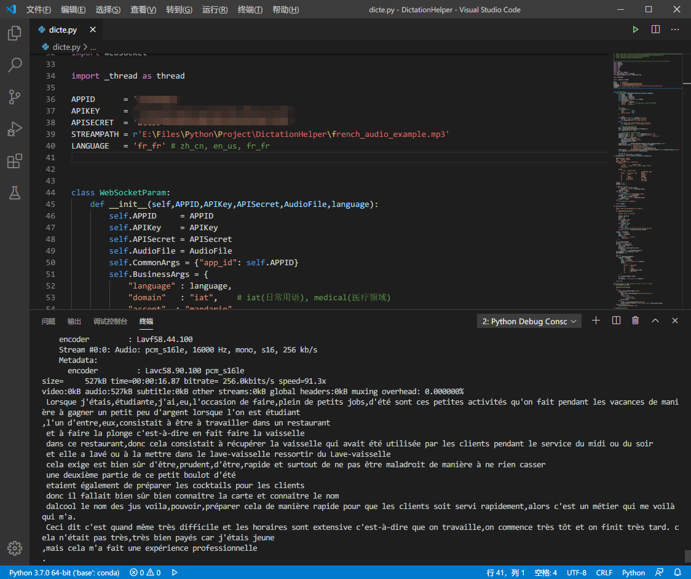

# DictationHelper
## Description

 **Automatic caption generation.**

No feedback when practicing listening skills? Too many "squanchy" words blocking oral comprehension? Let **DictationHelper** salvage you!

This python script aims to produce caption of a input audio or video file that helps you to understand the basic meaning of the material using API provided by **[iFlyTek]( https://www.xfyun.cn/  )**.

File formats that passed test: `mp3`, `mp4`.

## Supported language

Chinese, Chinese dialects, English, French, Russian, German, Japanese, Italian, Spanish, Thai, Arabia, Korean, ... (configurable in **iFlyTek console**). What a **multi-language** speaker !

But this script is **monolingual during one test**. That's to say, it can only understand **one** preset language at one input. 

## Requirements

### Python module

In addition to the `base` environment of Anaconda 3, the following modules are required:

|    name     | version |
| :---------: | :-----: |
| `websocket` |  0.2.1  |
|             |         |

### FFmpeg

Also, installation of `FFmpeg` is necessary. Click [ http://ffmpeg.org/ ]( http://ffmpeg.org/ ) to download suitable version on your platform. Make sure that `ffmpeg` and `ffprobe` is callable by your shell (If you are a Windows user, add the bin folder of `ffmpeg` to your system path). Example :

```shell
PS E:\Files\Python\Project\DictationHelper> ffmpeg

ffmpeg version git-2020-06-03-b6d7c4c Copyright (c) 2000-2020 the FFmpeg developers
  built with gcc 9.3.1 (GCC) 20200523
  ...
  ...
  ...
Hyper fast Audio and Video encoder
usage: ffmpeg [options] [[infile options] -i infile]... {[outfile options] outfile}...

Use -h to get full help or, even better, run 'man ffmpeg'
```

### IFlyTek API

Sign in [Iflytek](  https://www.xfyun.cn/  ) , go to console (upper right) and create a new APP instance of "语音听写（流式版）". Here you can set your language configuration for later dictation.



## Usage

Set the capitalized parameters in head of your script to start use.

```python
APPID      = 'xxx'
APIKEY     = 'xxx'
APISECRET  = 'xxx'
STREAMPATH = r'xxx'
LANGUAGE   = 'fr_fr' # zh_cn, en_us, fr_fr
```

Where `APPID`, `APIKEY`, `APISECRET` is provided in iFlyTek console,  `STREAMPATH` is the path to your audio/video file, and LANGUAGE is your preferred wanted language.

## Example



## Author

[Xp-speit2018]( https://github.com/Xp-speit2018 ) : hantjscnxp@outlook.com

## License

MIT

```
Copyright (c) <year> <copyright holders>

Permission is hereby granted, free of charge, to any person obtaining a copy
of this software and associated documentation files (the "Software"), to deal
in the Software without restriction, including without limitation the rights
to use, copy, modify, merge, publish, distribute, sublicense, and/or sell
copies of the Software, and to permit persons to whom the Software is
furnished to do so, subject to the following conditions:

The above copyright notice and this permission notice shall be included in all
copies or substantial portions of the Software.

THE SOFTWARE IS PROVIDED "AS IS", WITHOUT WARRANTY OF ANY KIND, EXPRESS OR
IMPLIED, INCLUDING BUT NOT LIMITED TO THE WARRANTIES OF MERCHANTABILITY,
FITNESS FOR A PARTICULAR PURPOSE AND NONINFRINGEMENT. IN NO EVENT SHALL THE
AUTHORS OR COPYRIGHT HOLDERS BE LIABLE FOR ANY CLAIM, DAMAGES OR OTHER
LIABILITY, WHETHER IN AN ACTION OF CONTRACT, TORT OR OTHERWISE, ARISING FROM,
OUT OF OR IN CONNECTION WITH THE SOFTWARE OR THE USE OR OTHER DEALINGS IN THE
SOFTWARE.
```

